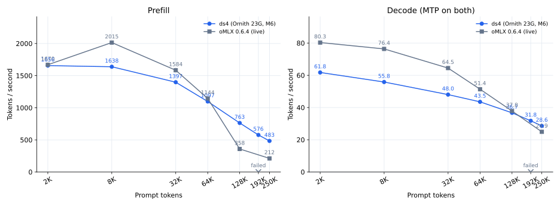
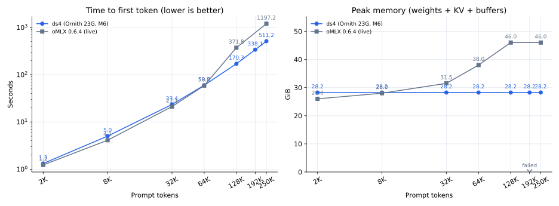

# Ornith on ds4 vs the live oMLX: M6 report (2026-09-28)

Branch `feature/ornith-m6` (from develop `696d328`), executed 2026-09-27 19:05 - 2026-09-28 01:00 inline, with one
opus whole-branch review and one fix pass. Every GPU measurement ran with the live AI-Gateway stack paused, one model
process at a time, nothing SIGKILLed, and the stack restored afterwards (`backend_ok`, gateway answering at 00:50).
Not merged, not pushed, not deployed. Spec: `docs/superpowers/specs/2026-09-27-ornith-m6-nax-attention-design.md`.

## TL;DR

ds4 now runs Ornith's prefill attention on the M5 Pro's neural accelerators (`DS4_QWEN35_ATTN_NAX=1`). With it:

- **Long context: ds4 wins decisively.** At 128K the first token arrives 1.3-2.2x sooner than on the live oMLX
  (146-170 s vs 184-372 s), at 250K 2.3x sooner (8.5 min vs 20 min) with 15% faster decode (28.6 vs 24.9 t/s).
- **Reliability at ~200K: ds4 wins.** The live oMLX aborted a 200K-token request (its process memory enforcer, at
  122,880 prefilled tokens); ds4 completed every length up to 250K.
- **Memory: ds4 wins.** ds4 holds 28.2 GiB from 2K to 250K (weights 21.3 + KV for the full 256K 5.5 + buffers);
  oMLX grows from 26 GiB at 2K to 46 GiB at 128K and stays pinned under its 48 GB guard.
- **Quality: ds4 ahead.** Eval index 83.7 (23G) / 85.0 (25G) vs oMLX 78.8 on the same harness the same day;
  abliteration probes identical.
- **Speed held at high context: ds4 holds better.** From 2K to 250K ds4 keeps 46% of its decode rate and 29% of its
  prefill rate; oMLX keeps 31% and 13%.
- **Short context: oMLX is still faster at decode.** 2K / 8K / 32K decode: ds4 62-70 / 56 / 48-53 vs oMLX 80 / 76 /
  64.5 t/s (oMLX also runs MTP). Time to first token is at parity at 2K and 64K; at 8K-32K oMLX was 10-20% sooner in
  the sweep (parity at 32K in the interleaved gate 3). This is the gap left for the next milestone (short-context
  decode: MoE and GDN decode kernels, launch overhead).

So "decisive" holds from ~100K up, for memory, for reliability and for quality; it does not hold for decode below
~64K, where oMLX leads by 15-37%.

## Head-to-head across context lengths (window `m6h2h`, 2026-09-27 23:55 - 2026-09-28 00:47)

`speed-bench/ornith/m6/h2h.py`: each runtime in turn (oMLX first, then ds4; one model process at a time), one cold
request per length ascending (two at <= 32K), 256 new tokens, thinking on, fresh nonce per prompt, peak memory
sampled every 2 s. ds4: `ds4-server --metal -c 262144 --mtp` with the 64K MTP draft vocabulary and
`DS4_QWEN35_ATTN_NAX=1`, snapshot of `0266bc6`, 23G GGUF. oMLX: the live registry command (0.6.4, oQ4 +
bf16 recurrence, MTP runtime, `--memory-guard-gb 48`). Raw: `h2h.json`, `h2h.csv`, `h2h.txt`, `h2h-logs/`.

| prompt | ds4 TTFT | oMLX TTFT | ds4 prefill t/s | oMLX prefill t/s | ds4 decode t/s | oMLX decode t/s | ds4 memory | oMLX memory |
|---|---:|---:|---:|---:|---:|---:|---:|---:|
| 2K | 1.3 s | 1.2 s | 1656 | 1670 | 61.8 | 80.3 | 28.2 GiB | 26 GiB |
| 8K | 5.0 s | 4.1 s | 1638 | 2015 | 55.8 | 76.4 | 28.2 GiB | 28 GiB |
| 32K | 23.4 s | 21.1 s | 1397 | 1584 | 48.0 | 64.5 | 28.2 GiB | 31.5 GiB |
| 64K | 59.8 s | 58.7 s | 1097 | 1144 | 43.5 | 51.4 | 28.2 GiB | 38 GiB |
| 128K | **170 s** | 372 s | **763** | 358 | 36.7 | 37.8 | **28.2 GiB** | 46 GiB |
| 192K | **338 s** | **aborted** | **576** | — | **31.8** | — | **28.2 GiB** | 46 GiB |
| 250K | **511 s** | 1197 s | **483** | 212 | **28.6** | 24.9 | **28.2 GiB** | 46 GiB |

How to read it:
- Memory is weights + KV + buffers on the same basis for both: ds4 maps its GGUF and makes it resident through Metal,
  so its 21.26 GiB of weights do not show in the process footprint; the chart adds them (the server's own line:
  "KV 5.50 GiB + buffers 1.00 GiB + resident model 21.26 GiB = 27.76 GiB planned"). System wired memory while ds4
  served stayed at 30.1-31.5 GiB from 2K to 250K (`h2h-ds4-rss.csv`).
- oMLX's 192K request (199,948 tokens) was rejected mid-prefill: "process memory limit exceeded (usage 46.1 GB, abort
  threshold 38.0 GB, dynamic ceiling 40.0 GB)" (`h2h-logs/omlx-memory-abort.txt`). After it shrank its caches it
  completed the 250K request.
- This sweep ran oMLX first and ds4 second after hours of continuous load, and one request per length above 32K. The
  fairer interleaved comparison (A-B-B-A, gate 3 below) puts ds4 at 69.5 / 53.1 / 40.1 t/s decode and 1.17 / 19.65 /
  146 s TTFT at 2K / 32K / 128K, against oMLX's 79.9 / 64.5 / 38.9 t/s and 1.18 / 19.67 / 184 s. oMLX's 128K TTFT
  moved from 184 s (gate 3) to 372 s here; its footprint was at its guard both times.
- Each runtime counts its own prompt tokens; oMLX counts ~2-3% more for the same text.

## What M6 built

- `kernel_qwen35_attn_qpack` + `kernel_qwen35_attn_flash_nax` (`metal/qwen35.metal`, inside `#ifdef
  DS4_METAL_HAS_TENSOR`): queries packed to half, then Q Kᵀ and P V on `matmul2d` fragments (the M5 neural
  accelerators), 8 query tokens x 8 heads per threadgroup, the 256 head dims split across simdgroup pairs, online
  softmax in registers, keys past the cache fill zero-loaded, M5's key split and `merge3` for short chunks.
- Per layer at 30,720 / 122,880 keys (T = 2048): 61.7 / 249.5 ms vs 222 / 882 ms for the M5 simdgroup flash
  (**3.6x**, ~17 TFLOP/s); short chunks (T = 16..256) 2-4x faster, so no minimum chunk size (`BENCH.md`).
- Dispatch knob `DS4_QWEN35_ATTN_NAX` (default off, see the decision below); fallback to the M5 flash without the
  tensor API (`--quality`, pre-M5, `DS4_METAL_DISABLE_METAL4=1`).
- In the model: the attention layers' stage (projections + attention) per 2048-token chunk is 958 ms at 30K and
  3,303 ms at 123K (M5: 2,423 / 8,916 ms); lever A/B
  prefill +68% at 32K, +152% at 128K, +55% cold ~31K, decode unchanged (`LEVERS.md`).

How it got there (`BENCH.md`): the kernel as planned (A1) ran only 1.1x; a reference on the same GPU (MLX 0.32: 16-22
TFLOP/s GEMM, 24.6 TFLOP/s fused attention at head dim 128) showed the hardware was not the limit; kernel variants
isolated the matrix loop itself; the root cause was `#pragma unroll` leaving the fragment arrays in thread memory.
With `clang loop unroll(full)`, the dims-split variant (A2) reached 3.6x.

## Gates

| gate | result |
|---|---|
| gate 1 (llama.cpp references), chunks 2048 / 64 / 65, accelerator on | PASS x3 |
| `--mtp` byte-identical to plain decoding (`test_qwen35_graph`, `test_qwen35_mtp`, `test_mtp_cli.py`) | PASS |
| fallback unchanged: dumps with `DS4_METAL_DISABLE_METAL4=1` (and with the knob off) vs develop | 0 of 39 differ |
| gate 2 (quality, parity rule), accelerator on | PASS: 83.7 / 85.0 vs oMLX 78.8; probes match; matrix 5/7 (two audit-turn timeouts, speed) |
| gate 3 (speed vs oMLX, A-B-B-A) | prefill above oMLX at 128K and cold ~31K, TTFT parity at 32K; decode below at 2K/32K (`speed/GATE3.md`) |
| Ornith live server tests, accelerator on | PASS (after the UTF-8 fix below) |
| Qwen3.8 full gate | PASS on the branch head (replies identical, needle hit, ~98-100% of PROD speed, wired 46.13 GiB = develop) |

## Decisions for you

1. **Turn the accelerator prefill on by default?** Everything passes with it on except one existing check,
   `ds4_test --qwen35-rewind` under MTP, which requires a session rewound through the verify snapshot (state built by
   the decode kernel) to match a fresh prefill within 2e-3 log-probability. With the accelerator prefill it misses by
   0.16: at the first decode step an MoE top-8 near-tie in layer 13 flips (expert 241 vs 138) under a ~3e-4 numeric
   difference between the accelerator prefill and `decode3`; the M5 flash and `decode3` share arithmetic, so they never
   flip it (`LEVERS.md` has the full isolation). My recommendation: turn it on and change that check to pin the
   prefill kernel it compares against (it tests the rewind mechanics, not kernel parity). Until you decide it stays
   off; deploys can set `DS4_QWEN35_ATTN_NAX=1`.
2. **Merge `feature/ornith-m6` into develop** (and push): not done without your OK.
3. **Serve Ornith from ds4 for long-context work?** The gateway's Ornith slot still runs oMLX. ds4 with the accelerator
   prefill is the better long-context and lower-memory runtime; oMLX is still faster for short-context chat. A deploy
   needs a `prod/<feature>-YYYYMMDD` branch and your OK.
4. **Next milestone: short-context decode.** Profile at 2K: ~0.5 ms per layer across all 40 layers (MoE and projections
   dominate; the GDN mixer uses shared qwen4 kernels); full unrolling of the qwen35 decode kernels changed nothing
   (measured). Closing 62-70 vs 80 t/s needs MoE / GDN decode work and fewer launches per token.

## Found and fixed along the way

- **`ds4-server` emitted invalid JSON** when a non-streamed completion was cut inside a multi-byte character
  (`max_tokens`, a forced think-budget close): `json_escape` copied the partial bytes. It now replaces ill-formed UTF-8
  with U+FFFD (valid text unchanged; Qwen replies stay byte-identical). Found because the accelerator prefill changed
  the live test's tokens (`0266bc6`, test `test_json_escape_replaces_invalid_utf8`).
- **Accelerator scratch not released at teardown** (final review): fixed (`5646d65`, test
  `test_attn_flash_nax_reinit`).
- The first Qwen full gate run read 46.48 GiB wired (bar 46.30) right after the oMLX / matrix runs; develop and the
  branch read 46.13 GiB each back to back in a fresh window (`QWEN_GATE.md`).

## Rulings I made (each with its cost if wrong)

1. Spec edits after approval (told in chat): knob read once like `DS4_QWEN35_ATTN_FLASH`; packed-query scratch as a
   `ds4_metal.m` slot; P as half; key-split bound over 8-token blocks. Cost: none functional.
2. Diagnose A1 before building A2 (MLX reference + kernel variants). Cost: one 10-min GPU window.
3. Test two concrete MLX differences before stopping (threadgroup-size attribute, full unroll). Cost: one window.
4. Full unroll (`QWEN35_NAX_UNROLL`) instead of the plan's `#pragma unroll` (the measured root cause). Cost: none.
5. No `max_total_threads_per_threadgroup` attribute (no consistent effect). Cost: < 3%.
6. Key-split dispatch at 256 threads (A2, not the plan's A1 at 128). Cost: none.
7. `DS4_QWEN35_ATTN_NAX` stays off by default because of the rewind check (decision 1). Cost: the gain stays opt-in.
8. Final-review M1 re-graded Important and fixed (stale scratch handle across engine reopen). Cost: a small test.
9. Fixed the pre-existing `json_escape` UTF-8 bug found by the live gate, as a separate commit. Cost: none for valid
   text.
10. Overnight: no new milestone started (short-context decode needs a spec you approve); the full-unroll decode probe
    was measured and not adopted.

Deferred minors (final review): M2 no `maxTotalThreadsPerThreadgroup >= 256` check; M3 dispatch does not check the
accelerator pipelines exist (override-source case); M4 stale `ds4_gpu.h` comments on the split scratch; M5 no separate
q4 payload receipt (covered by `--qwen35-payloads`); M6 no kernel test at 122,880 keys.

## Receipts

`BENCH.md` (kernel benchmark, stop rule, diagnosis), `LEVERS.md` (adoption, rewind isolation), `speed/GATE3.md`,
`quality/GATE2.md`, `QWEN_GATE.md`, `h2h.*` + charts (head-to-head), `h2h-logs/`.
